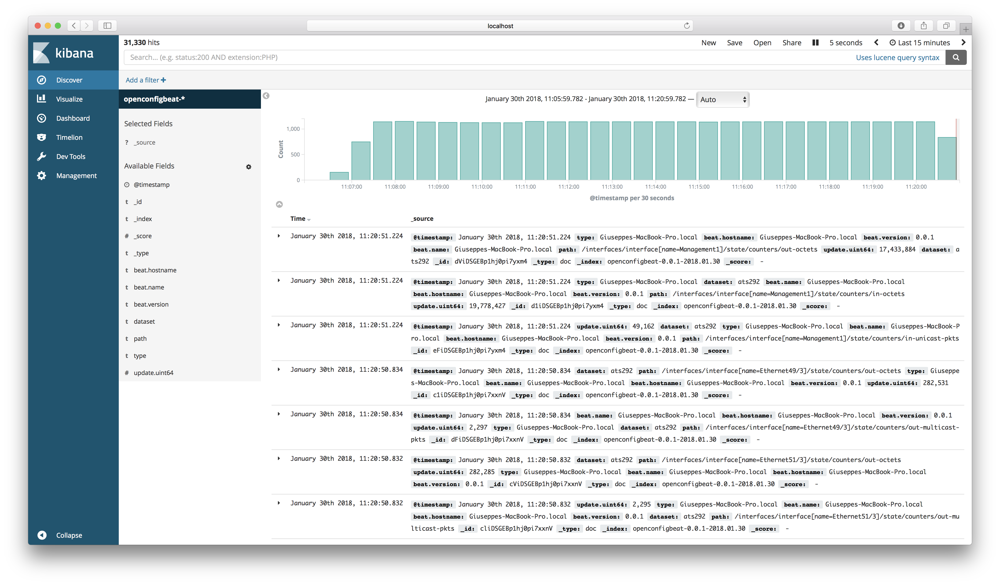

# Openconfigbeat

Welcome to Openconfigbeat, the Beat for [OpenConfig](http://openconfig.net)-compatible network devices.

Ensure that this folder is at the following location:
`${GOPATH}/src/github.com/aristanetworks`, or if you prefer you can download a prebuilt binary under [releases](https://github.com/aristanetworks/openconfigbeat/releases).



## Getting Started with Openconfigbeat

### Requirements

* [Golang](https://golang.org/dl/) >= 1.9
* [Glide](https://github.com/Masterminds/glide) >= 0.10.0

### Configuration
Edit `_meta/beat.yml` with the appropriate configuration.

### Build

To build the binary for Openconfigbeat run the command below. This will generate a binary
in the same directory with the name openconfigbeat.

```
make
```


### Run

To run Openconfigbeat with debugging output enabled, run:

```
./openconfigbeat -e -d openconfigbeat.go
```

To override an individual setting in the config file you can use `-E`, for example:
```
./openconfigbeat -E output.elasticsearch=elasticsearch:9200
```

To run as a container:

```
docker run aristanetworks/openconfigbeat -E openconfigbeat.addresses=device
```


### Update

Each beat has a template for the mapping in elasticsearch and a documentation for the fields
which is automatically generated based on `_meta/fields.yml`.
To generate `openconfigbeat.template.json` and `openconfigbeat.yml`:

```
make update
```


### Cleanup

To clean  Openconfigbeat source code, run the following commands:

```
make fmt
```

To clean up the build directory and generated artifacts, run:

```
make clean
```


### Clone

To clone Openconfigbeat from the git repository, run the following commands:

```
mkdir -p ${GOPATH}/src/github.com/aristanetworks
cd ${GOPATH}/src/github.com/aristanetworks
git clone https://github.com/aristanetworks/openconfigbeat
```


For further development, check out the [beat developer guide](https://www.elastic.co/guide/en/beats/libbeat/current/new-beat.html).
